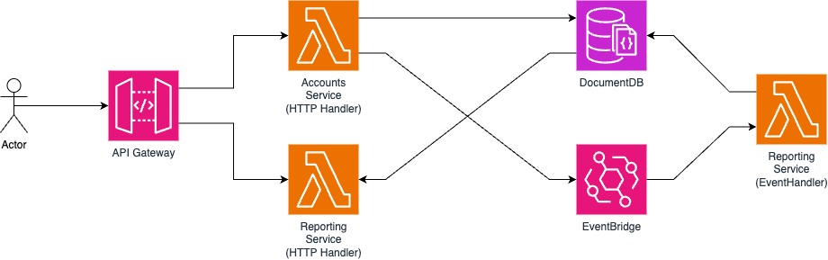
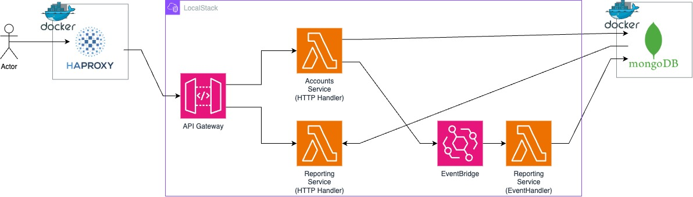

# Orbital test

The requested solution has been implemented using the requested technologies plus:
  + `localstack` for deploying and running locally
  + `Amazon CDK` for IAC
  + `Docker` to support all of the above plus deployment with (`docker compose up`)

## Key components

As most of the components are mandatory as per the assignment requirements the only components I'm using "extra" are:

* `API Gateway` This is where the clients connect and have their requests routed to the handling lambdas, this service is very feature rich and allows for very high degrees of control and customization
* `localstack` for developing the lambdas locally as it provides a cost free sandbox with very similar behavior to the cloud on many services.
* `Amazon CDK` for the infrastructure code, as it allows for `typescript` to describe the infrastructure nad deploy it to the provider (AWS or Localstack) 

## Architecture (AWS)

The development was done to work on AWS, the following architecture was chosen as reference (aas the actual development was done using `localstack`)

* Actor: The user
* API Gateway: Receives and routes the HTTP requests to the respective lambda handlers
* Accounts Service: Creates and gets accounts, manages transactions and maintains account balances
* Reporting Service: Gets monthly reports from the database
* DocumentDB: Works as a stand in for the mongodb as it should be compatible.
* Event Bridge: Routes events between services

## Architecture (localstack)

For the development side, I used `localstack` and that is where you can run the test code

* Actor: The user (you may use the [Swagger/OpenAPI](https://github.com/agah-pt/QLKXNNALAEPTRASG/blob/main/services/swagger.yml) docs to generate a client)
* HAProxy: Works as the load balancer so that you don't have to guess the `API Gateway` URL and the swagger tests work, as I added a script that configures it automatically.
* API Gateway: Receives and routes the HTTP requests to the respective lambda handlers
* Accounts Service: Creates and gets accounts, manages transactions and maintains account balances
* Reporting Service: Gets monthly reports from the database
* Event Bridge: Routes events between services
* MongoDB: The database

## Instructions

### 1. Install `docker`

Please ensure docker is installed and running on a Linux compatible host (I'm using an M1 Mac) 

### 2. `docker compose up`

Sit back and wait until everything is setup, here is the list:

  1. Install `mongodb`
  1. Install `localstack`
  1. Compile and run the `CDK` Infra
  1. Setup `HAProxy` to forward the HTTP calls

You should be able to see it here: [Swagger/OpenAPI](https://agah-pt.github.io/QLKXNNALAEPTRASG/swagger/) 

The application should be running here:  
Service endpoints: http://127.0.0.1:8080  
HAproxy stats page: http://127.0.0.1:8080/stats  

## Bonus points

### CI/CD Integration

Everything is automated to work with `docker compose`. We could build a formal CI/CD pipelines but those would just use what is already being done.

### Scalability Considerations

In order to handle high volumes of transactions and accounts I would for sure look at sharding as it would break up the usage cleanly across database instances, since that is the one item that is always hit when used. The main factor for sharding would be the accountId as it would break up both transactions into separate instances.

### Security Measures

I did not implement these but here is the rundown on how I would go about it, (I'm focusing on the API Gateway as it is something that is part of the infrastructure):

* Input sanitization, since I've created the OpenAPI doc we can enable validations on the API Gateway (see: https://docs.aws.amazon.com/apigateway/latest/developerguide/api-gateway-request-validation-set-up.html#api-gateway-request-validation-setup-importing-swagger)

* Authentication/Authorization could be done using username and passwords over an HTTPs connection, there we could generate a JWT and use it then, to do all that I would use an authorizer lambda (https://docs.aws.amazon.com/apigateway/latest/developerguide/configure-api-gateway-lambda-authorization.html)

* Rate limiting would also be handled by the APIGateway (ex: https://docs.aws.amazon.com/apigateway/latest/developerguide/api-gateway-request-throttling.html#apigateway-method-level-throttling-in-usage-plan)